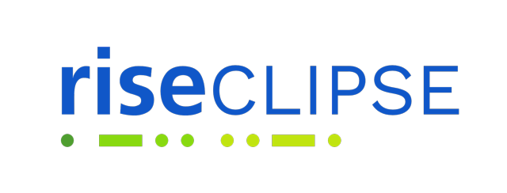
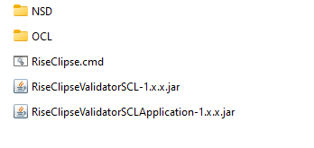

# RiseClipse downloads



## Validator for IEC 61850 SCL 2003 
This validator can use OCL and NSD files. It is « Work In Progress » because NSD support is incomplete (NOT IMPLEMENTED messages are sometimes displayed).

There is a [ChangeLog](https://github.com/riseclipse/riseclipse-validator-scl2003/blob/master/CHANGELOG.md) about the main changes between the different versions.

### Validator for a command line use (a Java runtime - at least version 21 - is required)
* Download [from this repository](https://github.com/riseclipse/riseclipse-validator-scl2003/releases):
  * the latest released jar: file `RiseClipseValidatorSCL-x.y.z.jar`  (a Java runtime - at least version 21 - is required),
  * or the latest released jar file in a zip: `RiseClipseValidatorSCL-x.y.z.zip` (a Java runtime - at least version 21 - is required),
* Use it (`java -jar RiseClipseValidatorSCL-x.y.z.jar`) in a Terminal/Cmd window; the command line arguments are given in a usage message. More details on [command line options](validatorSCLcommandLineHelp.md).
* The latest versions of RiseClipse OCL files for SCL are available in [this repository](https://github.com/riseclipse/riseclipse-ocl-constraints-scl2003), you can get the zip using the Code menu.
* NSD files are available on [the IEC site](https://www.iec.ch/dyn/www/f?p=103:227:502877425777072::::FSP_ORG_ID,FSP_LANG_ID:1273,25). The latest core files, as of July 10, 2025, are (give to RiseClipse only the `.nsd` file from the zip):
  * 2007A3: [IEC_61850-7-2](https://assets.iec.ch/public/tc57/IEC_61850-7-2.NSD.2007A3.light.zip), [IEC_61850-7-3](https://assets.iec.ch/public/tc57/IEC_61850-7-3.NSD.2007A3.light.zip), [IEC_61850-7-4](https://assets.iec.ch/public/tc57/IEC_61850-7-4.NSD.2007A3.light.zip)
  * 2007B4: [IEC_61850-7-2](https://assets.iec.ch/public/tc57/IEC_61850-7-2.NSD.2007B4.Light.zip), [IEC_61850-7-3](https://assets.iec.ch/public/tc57/IEC_61850-7-3.NSD.2007B4.Light.zip), [IEC_61850-7-4](https://assets.iec.ch/public/tc57/IEC_61850-7-4.NSD.2007B4.Light.zip)
  * 2007B5: [IEC_61850-7-2](https://assets.iec.ch/public/tc57/IEC_61850-7-2.NSD.2007B5.Light.zip), [IEC_61850-7-3](https://assets.iec.ch/public/tc57/IEC_61850-7-3.NSD.2007B5.Light.zip), [IEC_61850-7-4](https://assets.iec.ch/public/tc57/IEC_61850-7-4.NSD.2007B5.Light.zip)

### Validator with a graphical user interface
* Download [from this repository](https://github.com/riseclipse/riseclipse-validator-scl2003/releases):
  * the latest released jar: file `RiseClipseValidatorSCLApplication-x.y.z.jar` (a Java runtime - at least version 21 - is required),
  * or the latest released jar file in a zip: `RiseClipseValidatorSCLApplication-x.y.z.zip`  (a Java runtime - at least version 21 - is required),
  * or, on Windows, an installer of the latest released jar bundled with a JRE: `RiseClipseValidatorSCLApplication-x.y.z.msi`.
 * OCL (resp: NSD) files are expected to be in an `OCL` (resp: `NSD`) folder at the same level as the jar file; sub-folders can be used; see above for getting some.


* If you need to install a JRE on your laptop, you can download a JDK from [https://openjdk.org/](https://openjdk.org/) or [https://adoptium.net/](https://adoptium.net/).
* To launch the application:
  * On macOS, if you double click on the jar file, the OS will refuse to launch it because it is from an unknown developer. You have to allow it using the System Preferences, or launch it in a Terminal (`java -jar RiseClipseValidatorSCLApplication-x.y.z.jar`).
  * On Windows, you can put a `.cmd` file near the `.jar` files, with the content bellow.
Modify it to put the correct path to your JRE folder and the right version of the jar.
Then, double click on the `.cmd` file to launch RiseClipse
   
   ```
       @echo OFF  
       SET BINS=%~dp0  
       ECHO %BINS%  
       SET JAVA_HOME=C:\Temp\JDK_folder_name  
       SET PATH=%JAVA_HOME%\bin;%PATH%  
       %JAVA_HOME%\bin\java.exe -jar RiseClipseValidatorSCLApplication-x.y.z.jar  
       PAUSE
   ```
      

* Choose an SCL file using the button “Add SCL File” in the "SCL Files" tab.
* Optionally uncheck some OCL constraints in the "OCL Files" tab, or some NSD files in the "NSD Files" tab.
* Start the validation using the "Validate" button in the "SCL Files" tab.
* A new window will appear for the SCL file.

## Validator for ENTSO-E CGMES v3.0.0 (a Java runtime - at least version 17 - is required)
### Validator for a command line use
* Download the latest released `RiseClipseValidatorCGMES3-x.y.z.jar` [from this repository](https://github.com/riseclipse/riseclipse-validator-cgmes-3-0-0/releases)
* Use it (`java -jar RiseClipseValidatorCGMES3-x.y.z.jar`) in a Terminal/Cmd window; the command line arguments are given in a usage message. More details on [command line options](validatorCGMEScommandLineHelp.md).
* OCL files for CGMES 3.0.0 (adapted from those available on the ENTSO-E web site) are available in [this repository](https://github.com/riseclipse/riseclipse-ocl-constraints-cgmes-3), you can get the zip using the Code menu.

### Validator with a graphical user interface
* Download the latest released `RiseClipseValidatorCGMES3Application-x.y.z.jar` [from this repository](https://github.com/riseclipse/riseclipse-validator-cgmes-3-0-0/releases).
* OCL files are expected to be in an `OCL` folder at the same level as the jar file; sub-folders can be used; see above for getting some.
* Launch the jar.
* Add one or more CGMES files using the button in the "CGMES Files" tab.
* Optionally uncheck some OCL constraints in the "OCL Files" tab.
* Start the validation using the Validate button in the "CGMES Files" tab.
* A new window will appear with one general tab and one for each CGMES file.


