# RiseClipse Guide – Installation and OCL (20 January 2022)

### Download and install Eclipse Modelling
Install Eclipse Modelling 2021-12 : [2021-12 R | Eclipse Packages](https://www.eclipse.org/downloads/packages/release/2021-12/r)

### Install the necessary plug-ins
To install a plugin in Eclipse, go to: Help -> Install New Software, 

click on “What is already installed”, and check if the following points are intalled,

otherwise, install them :
- In “Work with” put : 2021-12 - http://download.eclipse.org/releases/2021-12 
- select the plugins to install :
  -	Eclipse SDK
  -	Eclipse Project SDK
  -	EMF – Eclipse Modeling Framework SDK
  -	OCL Examples and Editors SDK
  -	OCL Examples and Editors SDK developper resources
  -	EMF Validation Framework SDK
  -	UML2 Extender SDK

### Import data from GitHub
After all the initial requirements are met, it is possible to import the GitHub projects into Eclipse.

In Eclipse, first go to Window -> Show View -> Other… -> Git -> Git Repositories

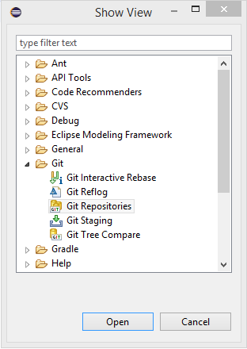 

A tab for the Git repositories will then be present in the layout of the Eclipse.

You must then import the following projects from GitHub :
- [riseclipse-ocl-constraints-scl2003](https://github.com/riseclipse/riseclipse-ocl-constraints-scl2003)
- [riseclipse-metamodel-scl2003](https://github.com/riseclipse/riseclipse-metamodel-scl2003)
- [riseclipse-main](https://github.com/riseclipse/riseclipse-main)
- [riseclipse-editor](https://github.com/riseclipse/riseclipse-editor)
- [riseclipse-metamodel-nsd2016](https://github.com/riseclipse/riseclipse-metamodel-nsd2016)

In Eclipse, choose the option “Clone a Git Repository” and put the HTTPS link from the Github 
into the “URI” box. The “Host” and “Repository path” should complete themselves automatically. 
Set the Connection Protocol to https and fill the GitHub User and Password in the Authentication.

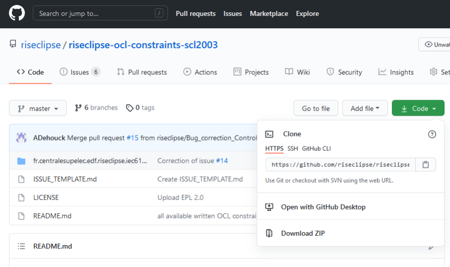

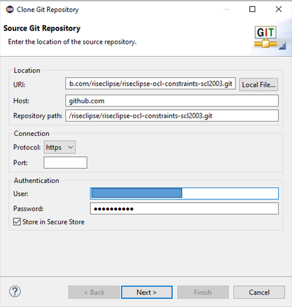

After cloning all the mentioned repositories, the Git Repositories tab should end up like bellow :

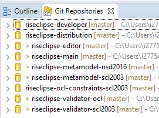
 
To import the projects, right click on every repository and “Import Projects…”. 
 
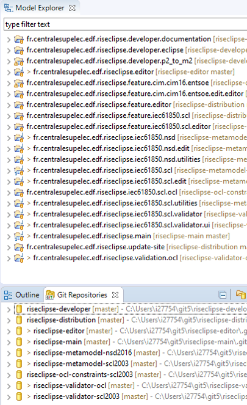

### Launch RiseClipse editor as an Eclipse Plugin

Select fr.centralesupelec.edf.riseclipse.editor in the Model Explorer,

Go to Run menu, and select “Run configuration”, then select Eclipse Application, and click on “Run”

This error can be ignored (click on “continue”)

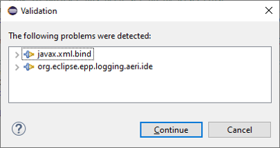
 
In the new Eclipse instance, create a project / empty OCL project

You can drag&drop your SCL files and OCL files in the Project Explorer.

Then, to open the SCL file, right click on it, “Open with” / “other”, and select “RiseClipse Model Editor”

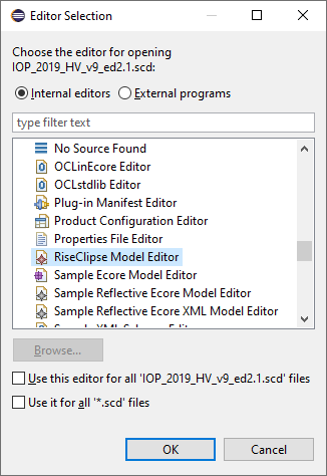
 
This opens the file, and you can visualize every element, and the properties of each element, 
and with the links that are built by RiseClipse.

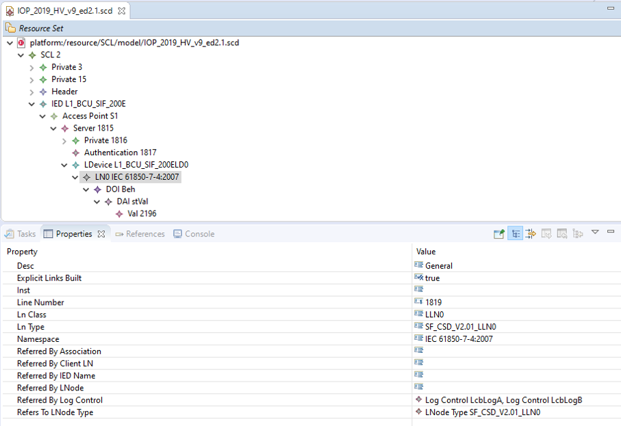
 
You can navigate inside the file, using the links and references built by RiseClipse, by 
selecting an object / right click / Selected object / Navigate to… 

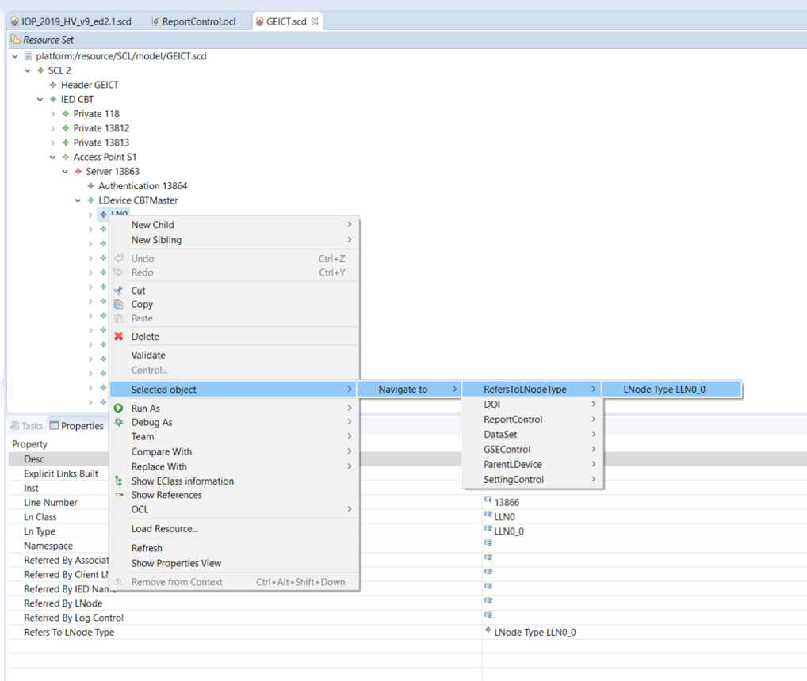 

In order to access the existing RiseClipse OCL files, it is possible to import the git 
project riseclipse-ocl-constraints-scl2003 into this second Eclipse instance.

In Eclipse, go to Window -> Show View -> Other… -> Git -> Git Repositories

Click on the first icon : “Add an existing local Git repository to this view”

### Validate a SCL file with an OCL file 

To validate a file with an OCL file, right click on the root element, and click on OCL / Load document.

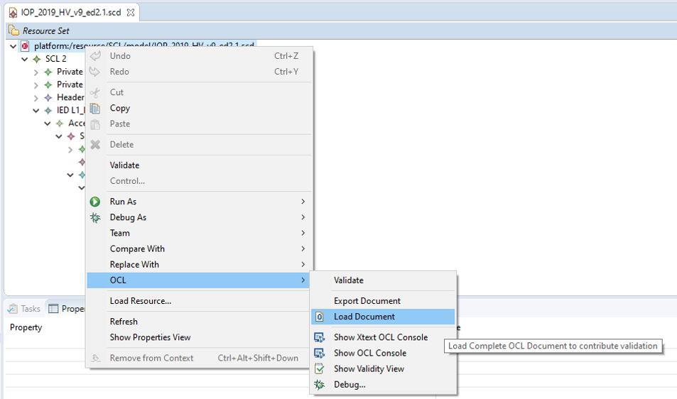

Select the OCL file in the workspace, or in the file system,

The OCL file is loaded bellow the SCL file :

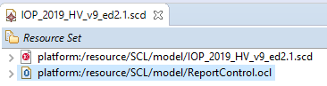

Select the SCL root, right click / Validate

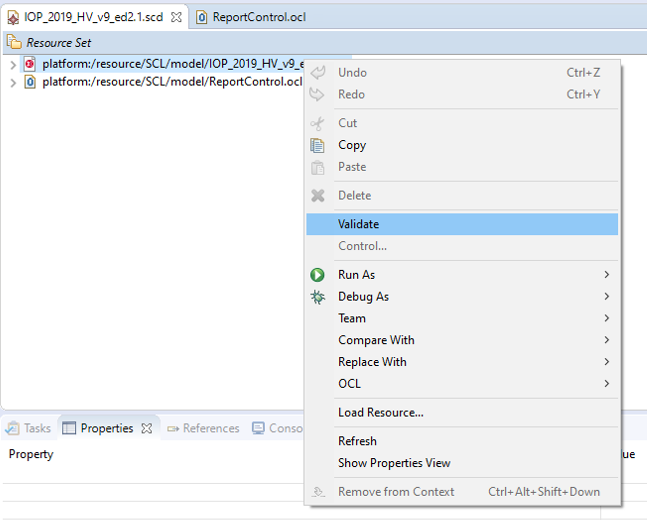
 
If the file does not respect the constraints defined in the OCL file, the errors will appear:

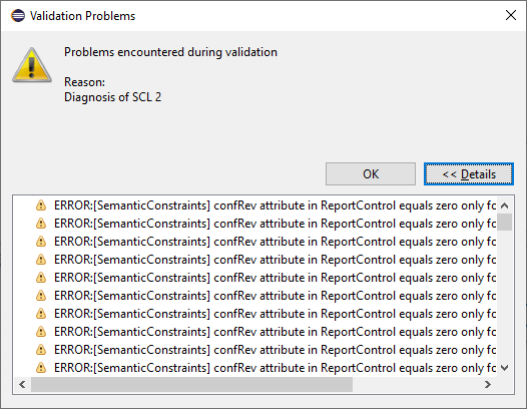

### Using the OCL console 

An easy way to help building new OCL constraints, is to use the OCL console :

Select an element in the SCL, right click / OCL / Show XText OCL Console
 
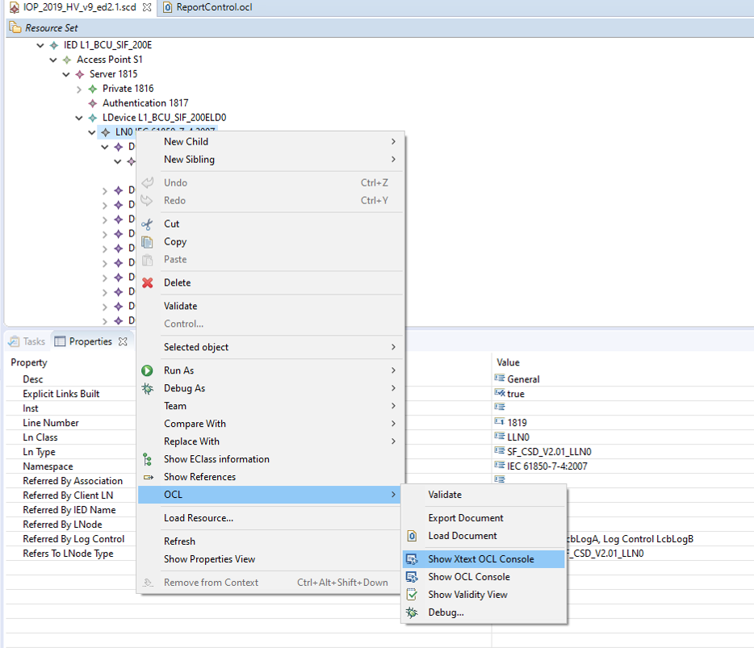

You can type OCL code in the console, and the result will be displayed (note that the 
context – the selected element in the SCL – is important)

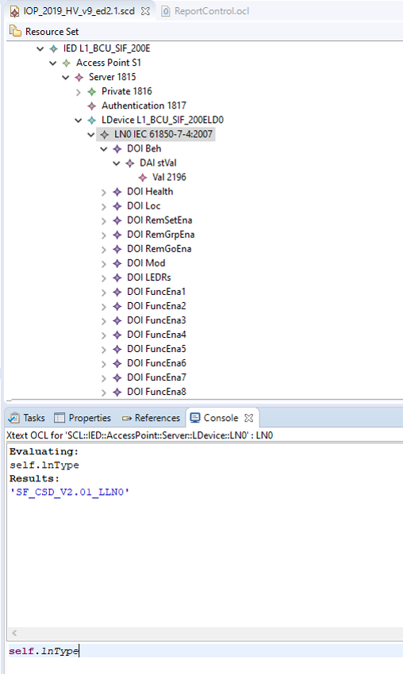 

### Modify or add an OCL constraint in GitHub, from Eclipse

First, you should create an Issue in GitHub, describing what you want to add or correct

Click on “New Issue” and describe the change as precisely as possible, and refer to the 
corresponding document (standard, TISSUE…)

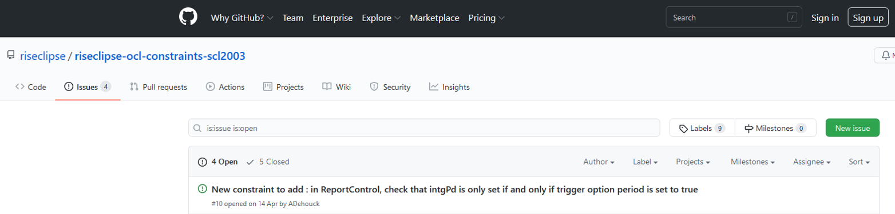 

Then, in Eclipse, you need to get the latest version of the code that is on Github (It 
might have been modified by other people).

In Git Repository tab, select : riseclipse-ocl-constraints-scl2003

Right click / Pull 

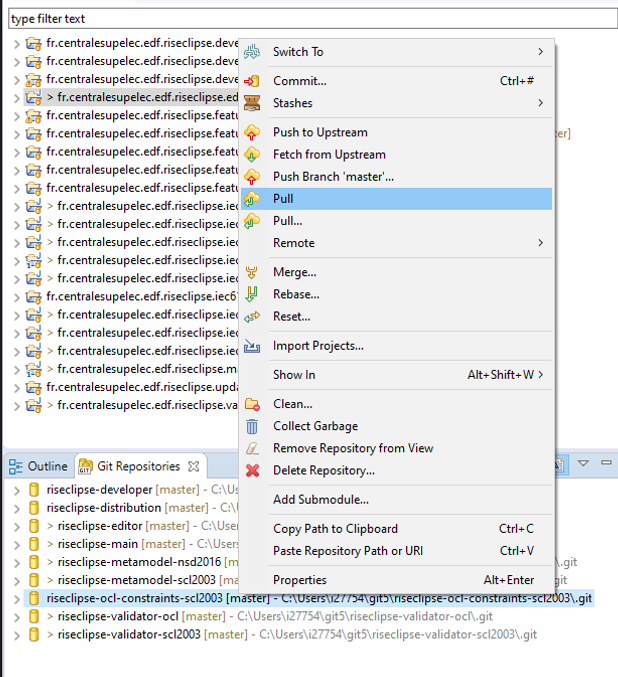
 
(for members of the project only – else do a Fork and pull model [About collaborative development models](https://docs.github.com/en/github/collaborating-with-issues-and-pull-requests/getting-started/about-collaborative-development-models))

Create a new branch, and switch into it : right click / Switch to / New branch

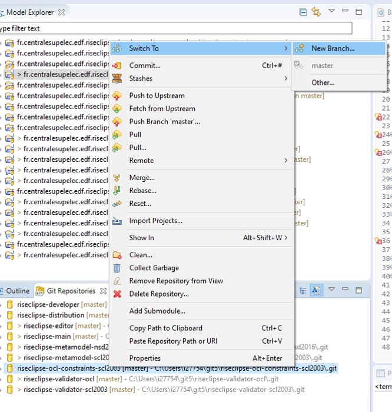
 
Implement the new constraint or correct an existing one.

Then, you need to commit the change: right click / Commit.

The list of your changes will be shown in the “Unstaged Changes” tab,

Use the green cross “+” to add you changes into the “Staged changes”

You should then write a “Commit message” that references the issue number that you implement

Then, click on “Commit and Push”

Go to the GitHub webpage, and create a “Pull request”

Your code will be reviewed, accepted, and the issue closed
